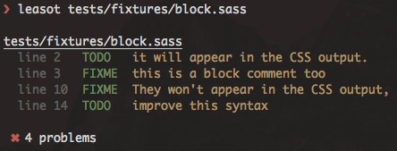

> Parse and output TODOs and FIXMEs from comments in your files

[](https://npmjs.org/package/leasot)
[](https://npmjs.org/package/leasot)
[](https://travis-ci.org/pgilad/leasot)

Easily extract, collect and report TODOs and FIXMEs in your code. This project uses regex in order
to extract your todos from comments.



## Comment format

`TODO: add some info`

- Spaces are optional.
- Colon is optional.
- Must be in a comment (line or block) in its' own line (`some code(); //TODO: do something` is not supported).
- Can be prefixed with a @ (i.e @TODO).
- Spaces are trimmed around comment text.
- Supported default types are `TODO` and `FIXME` - case insensitive.
- Additional types can be added (using `tags` in cli and `customTags` in `leasot.parse`)
- New extensions can be associated with bundled parsers as many languages have overlapping syntax
- Supports both leading and trailing references. E.g. `// TODO(tregusti): Make this better` or `// TODO: Text /tregusti`

## Supported languages:

| Filetype      | Extension            | Notes                                      | Parser Name         |
| ------------  | -------------------- | -------------------------------------------| ------------------- |
| C#            | `.cs`                | Supports `// and /* */` comments.          | defaultParser       |
| C++/C         | `.cpp` `.c` `.h`     | Supports `// and /* */` comments.          | defaultParser       |
| Coffee-React  | `.cjsx`              | Supports `#` comments.                     | coffeeParser        |
| Coffeescript  | `.coffee`            | Supports `#` comments.                     | coffeeParser        |
| Crystal       | `.cr`                | Supports `#` comments.                     | coffeeParser        |
| CSon          | `.cson`              | Supports `#` comments.                     | coffeeParser        |
| CSS           | `.css`               | Supports `/* */` comments.                 | defaultParser       |
| EJS           | `.ejs`               | Supports `<!-- -->` and `<%# %>`           | ejsParser           |
| Erb           | `.erb`               | Supports `<!-- -->` and `<%# %>`           | ejsParser           |
| Erlang        | `.erl` `.hrl`        | Supports `%` comments.                     | erlangParser        |
| Go            | `.go`                | Supports `// and /* */` comments.          | defaultParser       |
| Haml          | `.haml`              | Supports `/ -# <!-- --> and <%# %>`        | twigParser          |
| Handlebars    | `.hbs` `.handlebars` | Supports `{{! }}` and `{{!-- --}}`         | hbsParser           |
| Haskell       | `.hs`                | Supports `--`                              | haskellParser       |
| Hogan         | `.hgn` `.hogan`      | Supports `{{! }}` and `{{!-- --}}`         | hbsParser           |
| HTML          | `.html` `.htm`       | Supports `<!-- -->`                        | twigParser          |
| Jade          | `.jade` `.pug`       | Supports `//` and `//-` comments.          | jadeParser          |
| Java          | `.java`              | Supports `// and /* */` comments           | defaultParser        |
| Javascript    | `.js` `.es` `.es6`   | Supports `// and /* */` comments           | defaultParser       |
| Jsx           | `.jsx`               | Supports `// and /* */` comments.          | defaultParser       |
| Kotlin        | `.kt`                | Supports `// and /* */` comments.          | defaultParser       |
| Less          | `.less`              | Supports `// and /* */` comments.          | defaultParser       |
| Mustache      | `.mustache`          | Supports `{{! }}` and `{{!-- --}}`         | hbsParser           |
| Nunjucks      | `.njk`               | Supports `{#  #}` and `<!-- -->`           | twigParser          |
| Objective-C   | `.m`                 | Supports `// and /* */` comments           | defaultParser       |
| Objective-C++ | `.mm`                | Supports `// and /* */` comments           | defaultParser       |
| Pascal        | `.pas`               | Supports `// and { }` comments.            | pascalParser        |
| Perl          | `.pl`, `.pm`         | Supports `#` comments.                     | coffeeParser        |
| PHP           | `.php`               | Supports `// and /* */` comments.          | defaultParser       |
| Python        | `.py`                | Supports `"""` and `#` comments.           | pythonParser        |
| Ruby          | `.rb`                | Supports `#` comments.                     | coffeeParser        |
| Sass          | `.sass` `.scss`      | Supports `// and /* */` comments.          | defaultParser       |
| Scala         | `.scala`             | Supports `// and /* */` comments.          | defaultParser       |
| Shell         | `.sh` `.zsh` `.bash` | Supports `#` comments.                     | coffeeParser        |
| SilverStripe  | `.ss`                | Supports `<%-- --%>` comments.             | ssParser            |
| SQL           | `.sql`               | Supports `--` and `/* */` comments         | defaultParser & haskellParser |
| Stylus        | `.styl`              | Supports `// and /* */` comments.          | defaultParser       |
| Swift         | `.swift`             | Supports `// and /* */` comments.          | defaultParser       |
| Twig          | `.twig`              | Supports `{#  #}` and `<!-- -->`           | twigParser          |
| Typescript    | `.ts`                | Supports `// and /* */` comments.          | defaultParser       |
| Vue           | `.vue`               | Supports `//` `/* */` `<!-- -->` comments. | twigParser          |
| Yaml          | `.yaml` `.yml`       | Supports `#` comments.                     | coffeeParser        |

Javascript is the default parser.

**PRs for additional filetypes is most welcomed!!**

## Usage

### Command Line

#### Installation

```sh
$ npm install --global leasot
```

#### Examples

```sh
$ leasot --help

  Usage: leasot [options] <file ...>

  Parse and output TODOs and FIXMEs from comments in your files

  Options:

    -h, --help                           output usage information
    -V, --version                        output the version number
    -A, --associate-parser [ext,parser]  associate unknown extensions with bundled parsers (parser optional / default: defaultParser)
    -i, --ignore <patterns>              add ignore patterns
    -I, --inline-files                   parse possible inline files
    -r, --reporter [reporter]            use reporter (table|json|xml|markdown|vscode|raw) (default: table)
    -S, --skip-unsupported               skip unsupported filetypes
    -t, --filetype [filetype]            force the filetype to parse. Useful for streams (default: .js)
    -T, --tags <tags>                    add additional comment types to find (alongside todo & fixme)
    -x, --exit-nicely                    exit with exit code 0 even if todos/fixmes are found

  Examples:

    # Check a specific file
    $ leasot index.js

    # Check php files with glob
    $ leasot **/*.php

    # Check multiple different filetypes
    $ leasot app/**/*.js test.rb

    # Use the json reporter
    $ leasot --reporter json index.js

    # Search for REVIEW comments as well
    $ leasot --tags review index.js

    # Add ignore pattern to filter matches
    $ leasot app/**/*.js --ignore "**/custom.js"

    # Search for REVIEW comments as well
    $ leasot --tags review index.js

    # Check a stream specifying the filetype as coffee
    $ cat index.coffee | leasot --filetype .coffee

    # Report from leasot parsing and filter todos using `jq`
    $ leasot tests/**/*.styl --reporter json | jq 'map(select(.kind == "TODO"))' | leasot-reporter
```

#### Using in NPM

This _package.json_ snippet shows how to include leasot in your project development environment and set up as a task (`todo`). The `todo_suppress_error` task stops leasot causing npm to error, so it can be used in a build process without halting it.

```json
{
    "scripts": {
        "todo": "leasot src/**/*.js",
        "todo_suppress_error": "leasot src/**/*.js || true",
    },
    "devDependencies": {
        "leasot": "*"
    }
}
```

### Programmatic

#### Installation

```sh
$ npm install --save-dev leasot
```

#### Examples

```js
var fs = require('fs');
var leasot = require('leasot');

var contents = fs.readFileSync('./contents.js', 'utf8');
// get the filetype of the file, or force a special parser
var filetype = path.extname('./contents.js');
// add file for better reporting
var file = 'contents.js';
var todos = leasot.parse({ ext: filetype, content: contents, fileName: file });

// -> todos now contains the array of todos/fixme parsed

var output = leasot.reporter(todos, {
    reporter: 'json',
    spacing: 2
});

console.log(output);
// -> json output of the todos
```

### Build Time

* [gulp-todo](https://github.com/pgilad/gulp-todo)
* [broccoli-leasot](https://github.com/sivakumar-kailasam/broccoli-leasot)
* [todo-webpack-plugin](https://github.com/mikeerickson/todo-webpack-plugin)

## API

```js
var leasot = require('leasot');
```

`leasot` exposes the following API:

### .associateExtWithParser(parsers)

Associates a bundled parser with a new extension.

The `parsers` parameter must be completed in the following format:

```js
{
    '.cls': {
        parserName: 'defaultParser'
    }
}

```
The `parserName` property can also be an array of parsers.
```js
{
    '.sql': {
        parserName: ['defaultParser', 'haskellParser']
    }
}
```

### .isExtSupported(extension)

Check whether extension is supported by parser.

Specify an extension including the prefixing dot, for example:

`leasot.isExtSupported('.js'); //-> true`

**Returns**: `Boolean`

### .parse(options)

| Name                | Type       | Required | Default | Description                                           |
| ----                | ----       | -------- | ------- | -----------                                           |
| `ext`               | `string`   | Yes      |         | The extension the parse as including a prefixing dot. |
| `content`           | `string`   | Yes      |         | Content to parse                                      |
| `fileName`          | `string`   | No       |         | fileName to attach to todos output                    |
| `customTags`        | `array`    | No       | `[]`    | Additional tags (comment types) to search for (alongside todo & fixme) |
| `withIncludedFiles` | `boolean`  | No       | `false` | Parse also possible included file types (for example: `css` inside a `php` file |
| `associateParser`   | `object`   | No       |         | See `.associateExtWithParser` for syntax              |

**Returns**: `array` of comments.

```js
[{
    file: 'parsedFile.js',
    text: 'comment text',
    kind: 'TODO',
    line: 8,
    ref: 'reference'
}]
```

### .reporter(comments, config)

Use the specified reporter to report the comments.

`comments` is the array of comments received from `leasot.parse()`.

`config` is an object that will also be passed to the reporter itself (allowing custom options for each reporter).

It may also contain the specified reporter:

#### config.reporter

Can be a string indicating the [built-in reporter](#built-in-reporters) to use,
 or an external library used as a reporter.

Could also be a custom function `(comments, config)`

**Type**: `String|Function`

**Required**: `false`

**Default**: `raw`

## Built-in Reporters

- json
- xml
- raw
- table
- markdown
- vscode

Each reporter might contain config params that are useful only for that reporter:

### Markdown

Returns a markdown version of the todos.

### Options

#### newLine

How to separate lines in the output file. Defaults to your OS's default line separator.

**Type**: `String`

**Default**: `Your system default line feed`

### padding

How many `newLine`s should separate between comment type blocks.

**Type**: `Number`

**Default**: `2`

**Minimum**: `0`

### transformHeader(kind)

Control the output of a header for each comment kind (*i.e todo, fixme*).

**Type**: `Function`

**Default**:
```js
transformHeader: function (kind) {
    return ['### ' + kind + 's',
        '| Filename | line # | ' + kind,
        '|:------|:------:|:------'
    ];
}
```

**kind**: will be be passed as the comment kind (todo/fixme).

**Returns**: `String[]|String`

You are expected to return either an `Array of strings` or just a `string`. If you return an array - each item will be separated by a newline in the output.

### transformComment(file, line, text, kind, ref)

Control the output for each comment.

**Type**: `Function`

**Default**:
```js
transformComment: function (file, line, text, kind, ref) {
    return ['| ' + file + ' | ' + line + ' | ' + text];
}
```

**file**: filename the comment was in.

**line**: line of comment.

**text**: comment text. Default ''.

**kind**: will be be passed as the comment kind (todo/fixme).

**ref**: a reference. Default ''.

**Returns**: `String[]|String`

You are expected to return either an `Array of strings` or just a `string`. If you return an array - each item will be separated by a newline in the output.

### VSCode

Returns a markdown version of the todos customized for Visual Studio Code. The file names are
transformed as URLs and the line numbers as anchors which makes them clickable when the markdown
content produced with this reporter is opened on Visual Studio Code.

### Table

Returns a pretty formatted table of the todos.

### Raw

Just returns the raw javascript todos

### JSON

Return a JSON valid representation of the todos.

#### Options

##### spacing

Type: `Number`

Default: `2`

### XML

Return an unformatted XML valid representation of the todos.

Parsed using [json2xml](https://github.com/estheban/node-json2xml)

#### Options

##### header

Whether to include xml header

Type: `Boolean`

Default: `true`

##### attributes_key

See https://github.com/estheban/node-json2xml#options--behaviour

Type: `Boolean`

Default: `undefined`

## License

MIT ©[Gilad Peleg](http://giladpeleg.com)
